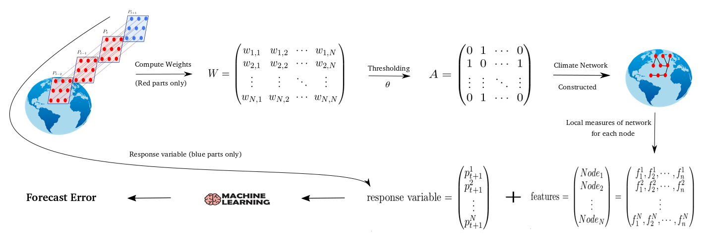

# Climate Network
In  this  paper,  we  try  to  exploit  climate  network  for
for  the  purpose  of  prediction  of  the  climate  variables,
and  use  the  predictive  power  of  network  to  go  back
to  the  construction  phase  and  find  the  best  method
for  creating  climate  network.  The  network  predictive
power  is  a  measure  that  can  be  used  to  find  the  cli-
mate network, which represents the underlying climate
system  effectively,  and  can  be  utilised  for  prediction
purposes.  It  can  be  defined  as  the  ability  of  network’s
local characteristics, like degree or centrality, to predict
the next value of time series at each node. We assume
that  the  network  with  the  highest  value  of  predictive
power  is  the  best  one  for  representing  the  underlying
climate system.

## Data
We use precipitation data for Africa from GPCC Global Precipitation Climatology Centre (https://www.esrl.noaa.gov/psd/data/gridded/data.gpcc.html) to construct the fully-connected weighted climate network. 
The data is taken from a land only region on earth, which has 38.75S-38.75N latitude 23.75W-58.75 E longitude with resolution of 2.5 degree. 
It has monthly precipitation time series of 635 grid points from January 1946 until January 2016 that they will be the nodes of the climate network.

## Climate Network Construction
Climate network is constructed from a set of climate time series measured at fixed points on earth. Those fixed points are considered as nodes of the network and edges are added between each pair of nodes based on degree of statistical association between two climate time series occurred at the two corresponding points on earth. 
The most common statistical association measure used in the past studies is correlation coefficient.
By computing correlation coefficient between each pair of nodes, the resulting matrix is a weight matrix of fully connected graph, and it is required to convert to an adjacency matrix of unweighted network by using a threshold level
## Feature Extraction
The following figure shows the detail of workflow of our proposed approach to measure the predictive power of climate network. 
We use NetworkX (https://networkx.github.io/) to create networks and Scikit-learn (https://scikit-learn.org/stable/) to run machine learning 
algorithms in Python. The precipitation data for the last month, which is specified with blue color on the diagram, is the response variable. 
This is the variable that the power of the network on how predicting it, is measured. The climate network is created based on the method explained in section 2. 
The precipitation data is used, either the original one or the one whose annual cycle has been removed, to generate a similarity matrix or a weight matrix, by computing correlation coefficient of the time series taken from each pair of nodes.
  By
choosing  a  threshold  level,  this  matrix  is  converted  to
adjacency  matrix  and  a  network  with  635  nodes  is
created.  Then  network  local  attributes  of  each  node  is
taken as a feature for a machine learning algorithm to
predict  the  response  variable  and  its  forecast  error  is
measured.  If  the  annual  cycle  of  the  input  data  was
removed,  it  should  be  added  back  to  the  data  when
forecast  error  is  measured.  Otherwise,  the  errors  of different input data will be in different ranges and they
will not be comparable. we  slide  threshold
from  0.05  to  0.95  with  step  of  0.05  and  at  each  step,
we create a climate network and measure its predictive
power.  We  can  consider  it  as  a  single  network  with
fixed  set  of  nodes,  but  its  edge  set  changes  according
to  the  level  of  the  threshold.  Basically,  the  network
has  a  lot  of  edges  at  the  low  level  of  threshold,  and
as  it  reaches  to  high  values,  just  few  edges  remain,
and  perhaps  no  edges  remain  at  values  close  to  one.
Features extracted from the network for each node are:
Degree,  Betweenness  centrality,  Closeness  centrality,
Eigenvector centrality, K-core centrality, Page-rank cen-
trality,  Average  neighbor  degree  and  Local  clustering
coefficient.

